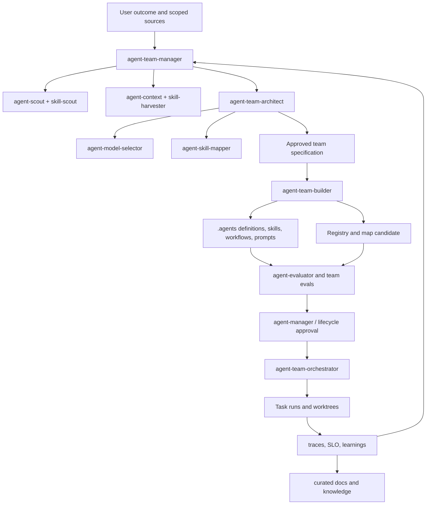

# Единый план: команды агентов, skills mapping и Agent OS

Статус: **approved for phased implementation**

Дата: **2026-07-31**

Scope: agent-oriented skills, project-local `.agents`, registries, team workflows,
model selection, docs/memory и будущая Agent OS.

## 1. Решения, предлагаемые на ревью

1. Создать `agent-team-manager`, `agent-team-builder`,
   `agent-team-orchestrator` и `agent-skill-mapper`, но развести их decision
   rights и mutation boundaries.
2. Добавить `agent-team-architect`: без отдельного design owner manager или
   builder неизбежно станет mega-skill.
3. Не создавать `agent-harvester` на первом этапе. Расширить `agent-context` и
   использовать `skill-harvester` для generic source intake.
4. Использовать JSON как canonical asset registry/map, JSON Schema для validation и
   генерировать Markdown-представления для людей, LLM Wiki и Obsidian.
5. Хранить project-local definitions, teams, workflows, prompts и skills в
   `.agents/`; не хранить там secrets и durable runtime history.
6. Рассматривать `docs/` как curated knowledge/documentation plane, но не как
   единственное runtime state или автоматически доверенную память.
7. Ввести `agent-model-selector`: model assignment является проверяемым design
   decision, а не свободным полем автора.
8. Разложить Agent OS на несколько plane-oriented skills и master prompts, а не
   создавать один всемогущий `agent-os` skill.
9. Сначала создать schemas, validators и read-only inventory; только потом
   разрешить builders/mappers менять agent definitions.
10. Изменения существующих metaskills выполнять отдельными кандидатами с
    SemVer, evals, generated rebuild и rollback.
11. Использовать `docs/AGENT-ASSET-REGISTRY.json` как canonical discriminated
    registry для agents, skills, commands, workflows и teams. Старое имя
    `AGENT-SKILLS-REGISTRY` не создавать как второй source of truth.
12. Private command наследует версию agent definition и имеет собственные
    revision/content hash; private/public skill сохраняет собственный SemVer.
13. `owner_agent_ref` задаёт technical consumer, а `accountable_owner` —
    ответственного человека или команду; agent не является governance owner.

## 2. Текущее состояние

- `.agents/` содержит только Codex marketplace manifest.
- `skills-lock.json` в repository сейчас отсутствует; любые skills-lock formats
  должны discover/validate, а не предполагаться.
- `docs/AGENT-ASSET-REGISTRY.*` и `docs/AGENT-SKILLS-MAP.*` создаются в Phase 1.
- Agent best-practices corpus существует в
  `skills/agent-skills/agent-best-practices/best-practices/`.
- Общий base и master prompts для agent-oriented skills существуют в
  `docs/prompts/`.
- Canonical metaskills находятся в `skills/metaskills/`; generated plugin trees
  редактировать напрямую нельзя.

Следствие: первый implementation slice — contracts и read-only discovery, а не
автоматическое создание команды.

## 3. Целевая модель



`agent-team-manager` является control-plane facade и lifecycle coordinator. Он
может довести end-to-end запрос до результата через specialists, но не
реализует их работу внутри себя.

### 3.1 Оптимизация роста skills: public и agent-private capabilities

Решение: принять идею с уточнением semantics. `private` означает
**agent-scoped discovery и binding**, но не secrecy. Процесс с filesystem access
может прочитать файл; confidentiality обеспечивают repository ACL, sandbox,
runtime identity/policy и раздельные credentials.

Visibility — отдельный profile поверх primary archetype, а не новый тип skill.
Перед созданием каждого capability применяется placement gate:

| Decision | Критерий |
|---|---|
| `INLINE` | короткое stable правило без resources, tests и lifecycle |
| `PRIVATE_COMMAND` | один agent, narrow named action/template |
| `PRIVATE_SKILL` | один agent, reusable multi-step capability с resources/scripts/evals |
| `PUBLIC_SKILL` | два independent consumers или independent owner/contract/release lifecycle |
| `TOOL_SCRIPT` | deterministic execution — главный constraint |
| `WORKFLOW` | durable stages/state/coordination — главный constraint |
| `USE_EXISTING`/`REJECT` | duplication или insufficient value |

Это предотвращает uncontrolled public skill sprawl и разрастание непрозрачных
mega-prompts внутри agents. Private skill сохраняет identity, SemVer, evals и
registry entry; private command имеет облегчённый contract и регистрируется как
owned agent asset.

Promotion `private → public` выполняется при появлении второго independent
consumer либо самостоятельного lifecycle. Demotion `public → private` допустим
только после consumer inventory, доказавшего одного remaining owner. Обе
операции являются topology migrations через `skill-refactor`, а не folder move.

## 4. Границы новых навыков

### 4.1 `agent-team-architect` — добавить

Primary archetype: orchestration/design workflow.

Ответственность:

- анализировать goal, codebase, documents, data, constraints и risk;
- построить capability/task graph;
- решить, где нужен code/workflow, agent, subagent, orchestrator или human;
- определить roles, mission, non-goals, tools, permissions, context, state;
- выбрать topology, communication, handoff и independent verification;
- выбрать sequential/parallel/DAG/dynamic workflow;
- определить worktree/write-set strategy;
- запросить model recommendation у `agent-model-selector`;
- запросить skill bindings у `agent-skill-mapper`;
- создать immutable `AGENT-TEAM-SPEC.json` и human-readable plan.

Не создаёт `.agents` и не запускает team. Design change после approval создаёт
новую spec revision.

### 4.2 `agent-team-manager`

Primary archetype: meta/router + lifecycle orchestration.

Modes:

- `assess` — worth, inventory и readiness;
- `design` — dispatch `agent-team-architect`;
- `build` — dispatch `agent-team-builder` после approval;
- `map-skills` — dispatch `agent-skill-mapper`;
- `evaluate` — dispatch evaluator;
- `activate/suspend/retire` — dispatch lifecycle manager;
- `run` — dispatch `agent-team-orchestrator`;
- `audit/reconcile` — registry, definitions, mappings и observed state;
- `resume` — восстановить phase ledger и drift check.

Общий flow:

1. Resolve outcome, exact sources, authority и destination.
2. Inventory existing agents, skills, locks, workflows и docs.
3. `agent-scout` проверяет необходимость agents/roles.
4. `skill-scout` проверяет необходимость новых skills.
5. `agent-context`/`skill-harvester` заполняют evidence gaps.
6. Architect создаёт team spec и alternative workflows.
7. Manager показывает варианты, модели, worktrees, mutations и risks.
8. После выбора builder создаёт staged project-local artifacts.
9. Evaluator проверяет definitions, routing, delegation, safety и E2E.
10. Manager обновляет lifecycle state только после approval/evidence.

Manager не изменяет active definitions одновременно с evaluation и не запускает
команду по одному факту создания файлов.

### 4.3 `agent-team-builder`

Primary archetype: artifact/template + script-backed workflow.

Вход: approved, versioned `AGENT-TEAM-SPEC.json`.

Ответственность:

- создать staged `.agents` tree;
- вызвать `agent-architect` для role/agent master prompts и definitions;
- вызвать `skill-architect` для отсутствующих project-local skills;
- создать orchestrator/team/workflow prompts;
- создать Agent OS prompt только если spec требует platform layer;
- materialize model policies и skill bindings;
- создать/update canonical registry/map кандидаты атомарно;
- запустить schemas, official validators и package evals;
- вернуть diff, artifacts, evidence и rollback.

Builder не принимает решение, нужна ли команда, не выбирает topology заново и
не активирует built agents.

### 4.4 `agent-team-orchestrator`

Primary archetype: runtime orchestration.

Вход: approved team/version, task envelope, authority и budgets.

Ответственность:

- классифицировать task относительно team capabilities;
- предложить 2–4 viable workflows при существенном design choice;
- построить task DAG, dependencies, owners и exit gates;
- выбрать sequential/parallel/fork–join/worktree execution;
- dispatch agents/subagents с minimal context capsules;
- управлять leases, budgets, checkpoints, retries и cancellation;
- интегрировать результаты через independent verifier;
- вести run state и evidence;
- завершать, эскалировать или безопасно останавливать run.

Не меняет static team/agent/skill definitions во время run. Improvement signal
идёт manager/doctor/optimizer как новый candidate change.

### 4.5 `agent-skill-mapper`

Primary archetype: evaluation/tool integration.

Modes:

- `inventory` — read-only agents/skills/locks/registry;
- `recommend` — candidate mappings с evidence;
- `apply` — staged agent/map updates после approval;
- `verify` — host discovery и functional binding;
- `reconcile` — drift, missing/unknown/incompatible bindings;
- `unmap/migrate` — consumer-safe removal/replacement.

Источники:

- registered project agents;
- `.agents` definitions;
- canonical skill registry;
- `skills-lock.json`, если он существует и schema известна;
- project-created skills;
- installed/discoverable skills target host;
- marketplace/lock/provenance metadata;
- behavior/routing/security eval evidence.

Matching учитывает capability, positive/negative triggers, input/output schemas,
host compatibility, versions, tools, permissions, data policy, risk, context
cost, owner и eval status. Semantic similarity или имя skill недостаточны.

Mutation rules:

1. Show candidate mapping and exact agent diff.
2. Verify skill provenance, version, availability и trust state.
3. Obtain mutation authority.
4. Update canonical map and generated agent bindings in one staged candidate.
5. Bump affected agent version.
6. Run routing, coexistence, authority и E2E evals.
7. Update registry version/hash after pass.
8. Never install missing skill by implication; hand off to `skill-manager`.

### 4.6 `agent-model-selector` — добавить как обязательный dependency

Primary archetype: evaluation/router.

Ответственность:

- discover current host/provider model catalog;
- derive capability constraints for each role/task;
- create representative task set and safety/latency/cost floors;
- evaluate candidate models and reasoning/effort settings;
- recommend fixed, tiered or routed model policy;
- record version/snapshot, evidence, fallback и review date;
- trigger re-evaluation on deprecation, behavior drift or task change.

Model selector не меняет model assignment in-place; builder/manager applies an
approved policy and bumps the agent version.

### 4.7 `agent-workspace-manager` — рекомендуется

Отдельный script-backed skill нужен, если команды регулярно выполняют
параллельные code changes.

Ответственность:

- worktree inventory и collision check;
- create/assign worktree to exact task/write-set;
- verify base revision и branch policy;
- heartbeat/status и orphan detection;
- integration handoff;
- safe cleanup после merge/abandonment.

Worktree не является security boundary и не нужен для read-only research,
непересекающихся artifacts вне Git или короткой single-agent задачи.

### 4.8 `agent-knowledge-manager` — рекомендуется

Владеет curated docs/memory plane, provenance, freshness, Graphify и optional
indexes. Не является runtime conversation memory и не разрешает всем agents
перезаписывать knowledge base.

## 5. Решение по `agent-harvester`

**Не создавать сейчас.**

Причины:

- `skill-harvester` уже умеет repository/document/session/trace intake;
- созданный master prompt `agent-context` покрывает agent definitions, policies,
  traces, runbooks, pairwise comparison и external intake;
- отдельный harvester создаст overlap по triggers, inbox и provenance;
- downstream output всё равно должен пройти architect/evaluator.

В `agent-context` следует добавить routes:

- `external-agent-intake`;
- `agent-pattern-harvest`;
- `trace-and-failure-harvest`;
- `team-context-build`;
- `agent-pairwise-comparison`.

Пересмотреть решение после двух условий одновременно:

1. Не менее трёх recurring workflows требуют извлекать reusable agent
   components из чужих agent ecosystems.
2. Выход отличается от `AGENT_CONTEXT.md`: нужен versioned component manifest,
   license/supply-chain review и downstream packaging.

Тогда `agent-harvester` может отвечать именно за reusable component intake, а
`agent-context` — за evidence context конкретного решения.

## 6. Registry и mapping format

### 6.1 Решение о формате

Canonical:

- `docs/AGENT-ASSET-REGISTRY.json`;
- `docs/AGENT-SKILLS-MAP.json`.

Generated human views:

- `docs/AGENT-ASSET-REGISTRY.md`;
- `docs/AGENT-SKILLS-MAP.md`.

Schemas:

- `docs/schemas/agent-asset-registry.schema.json`;
- `docs/schemas/agent-skills-map.schema.json`;
- `docs/schemas/agent-team-spec.schema.json`;
- `docs/schemas/agent-definition.schema.json`.

Почему не Markdown-only: таблицы не дают строгих types, uniqueness,
referential integrity и atomic validation. Почему не YAML canonical: удобство
ручного редактирования не компенсирует неоднозначные scalar types, anchors и
различия parsers. JSON остаётся portable и хорошо валидируется; Markdown
генерируется для Obsidian/GitHub.

### 6.2 Registry contract

Asset registry хранит typed inventory и lifecycle, а не runtime state. Stable
ID не зависит от locator; file move не меняет identity:

```json
{
  "schema_version": 1,
  "revision": 1,
  "updated_at": "2026-07-30T00:00:00Z",
  "assets": [
    {
      "id": "asset://project/agent/code-reviewer",
      "kind": "agent",
      "name": "code-reviewer",
      "version": "1.0.0",
      "content_sha256": "sha256:...",
      "source": ".agents/definitions/code-reviewer/agent.json",
      "accountable_owner": "team-or-person",
      "status": "candidate",
      "risk_tier": "R1",
      "model_policy_ref": "model-policy://code-reviewer-v1",
      "team_refs": [],
      "workflow_refs": [],
      "eval_evidence": [],
      "replacement": null
    },
    {
      "id": "asset://project/skill/code-review",
      "kind": "skill",
      "name": "code-review",
      "version": "1.0.0",
      "source_type": "project|installed|locked|marketplace|external",
      "locator": ".agents/skills/code-review",
      "content_sha256": "sha256:...",
      "visibility": "public|private",
      "scope": "repository|project|agent",
      "discoverability": "global|project|agent_scoped",
      "owner_agent_ref": null,
      "allowed_consumers": [],
      "accountable_owner": "team-or-person",
      "provenance": {},
      "host_compatibility": [],
      "trust_status": "unreviewed|verified|quarantined|revoked",
      "lifecycle_status": "candidate"
    },
    {
      "id": "asset://project/command/code-reviewer/handoff",
      "kind": "command",
      "name": "handoff",
      "version": null,
      "revision": 1,
      "version_strategy": "inherit_agent",
      "parent_version_ref": "asset://project/agent/code-reviewer@1.0.0",
      "content_sha256": "sha256:...",
      "locator": ".agents/definitions/code-reviewer/commands/handoff.md",
      "visibility": "private",
      "scope": "agent",
      "discoverability": "agent_scoped",
      "owner_agent_ref": "asset://project/agent/code-reviewer",
      "allowed_consumers": ["asset://project/agent/code-reviewer"],
      "accountable_owner": "team-or-person",
      "lifecycle_status": "candidate"
    }
  ]
}
```

Discovered unregistered asset добавляется как candidate/unreviewed только в
staged inventory; обнаружение не означает trust, assignment или activation.

Для private skill/command `owner_agent_ref` обязателен, `allowed_consumers` включает
owner, locator находится внутри canonical agent-private root, а
`discoverability` равен `agent_scoped`. Validator запрещает public entry в
private root и private binding для неразрешённого agent.

### 6.3 Mapping contract

Map — canonical binding source. Host adapters render embedded skill lists from
него; вручную поддерживать две независимые maps запрещено.

```json
{
  "schema_version": 1,
  "revision": 1,
  "bindings": [
    {
      "id": "binding://code-reviewer/code-review",
      "agent_ref": "asset://project/agent/code-reviewer@1.1.0",
      "capability_ref": "asset://project/skill/code-review@^1.0.0",
      "mode": "required|optional|fallback",
      "capabilities": ["review.code.correctness"],
      "activation": "always|on_intent|by_orchestrator",
      "constraints": [],
      "evidence": [],
      "status": "candidate|verified|deprecated|revoked",
      "owner": "..."
    }
  ]
}
```

Validator проверяет uniqueness, agent/skill references, compatible versions,
status, cycles, unavailable required skill, permission escalation и parity с
generated host bindings.

### 6.4 Version policy при skill mapping

- **Patch**: исправлен non-functional metadata/description, runtime binding не
  изменился.
- **Minor**: добавлен backward-compatible optional/required capability без
  изменения mission/input/output/authority; behavior evals обязательны.
- **Major**: удалён/replaced required skill, изменены mission, contracts,
  permissions, data classes, state ownership или compatibility.
- Mapping revision увеличивается при любом изменении map.
- Registry agent entry обновляется только вместе с definition hash и candidate
  evidence; version нельзя увеличить без реального artifact change.

## 7. Целевая `.agents` структура

```text
.agents/
├── definitions/                 # canonical project-local agent definitions
│   └── <agent>/
│       ├── agent.json
│       ├── prompt.md
│       ├── skills/              # private, scoped to this agent
│       │   └── <skill>/SKILL.md
│       ├── commands/            # private lightweight named actions
│       │   └── <command>.md
│       └── adapters/            # only required host projections
├── teams/
│   └── <team>/team.json
├── workflows/
│   └── <workflow>/workflow.json
├── skills/                      # public project-local skills
│   └── <skill>/SKILL.md
├── prompts/                     # generated role/team/OS prompts
├── policies/                    # project policy refs, no secrets
├── schemas/                     # runtime-local schemas if not in docs/schemas
├── evals/                       # team/agent integration fixtures
├── plugins/                     # existing Codex marketplace view
└── state/                       # ephemeral; gitignored or external durable store
```

Rules:

- `.agents/definitions`, `teams`, `workflows`, `skills`, `prompts`, `policies`
  are version-controlled procedural assets.
- `.agents/state` contains runs, leases, heartbeats, worktree assignments and
  checkpoints; secrets are external, and retention is explicit.
- `AGENTS.md` remains repository instruction surface, not a substitute for agent
  definitions or registry.
- Platform-specific file names/locations are adapters and MUST be verified
  against current host docs before generation.
- Generated projections contain source/hash headers and are not manually edited.
- Global loaders scan only approved public roots. Runtime attaches an agent's
  private root after identity/policy resolution; wildcard scan of
  `definitions/*/skills` is forbidden.
- Every public/private skill and private command is registered. Path placement
  is evidence, while registry plus observed loader behavior form the enforced
  contract.

## 8. Model recommendation policy

### 8.1 Основной принцип

Назначать не «самую умную» модель, а минимальную модель/configuration, которая
стабильно проходит role-specific quality и safety floors. Official guidance
также рекомендует соотносить capability, latency и cost и использовать smaller
models для простых high-volume subtasks
([OpenAI models](https://developers.openai.com/api/docs/models),
[Anthropic model choice](https://platform.claude.com/docs/en/about-claude/models/choosing-a-model),
[Google Gemini models](https://ai.google.dev/gemini-api/docs/models),
[Microsoft host guidance](https://learn.microsoft.com/en-us/agents/architecture/host-platform)).

Model names ниже — current examples, checked 2026-07-30, а не вечные defaults.
`agent-model-selector` обязан читать current provider/host catalog и запускать
evals перед фиксацией production policy.

### 8.2 Рекомендуемые tiers для текущего Codex/OpenAI portfolio

| Role/task | Starting model policy | Reasoning | Escalation |
|---|---|---|---|
| Router, classifier, formatter | GPT-5.6 Luna where available; otherwise Terra | none/low | Terra medium on low confidence |
| Document extraction/indexing | Luna or Terra | low/medium | Sol only for ambiguous synthesis |
| Routine specialist/subagent | GPT-5.6 Terra | medium | high or Sol on failed gate |
| Coding implementer | Terra medium/high | task-dependent | Sol high for difficult architecture/debugging |
| Architect/team designer | GPT-5.6 Sol | high | xhigh for measured hard cases |
| Orchestrator/merge owner | Sol or Terra after eval | medium/high | Sol high on conflict/high risk |
| Independent evaluator/security | Sol, isolated context | high/xhigh | alternate strong model family if policy allows |
| Long-horizon critical analysis | Sol | xhigh; max/pro only if eval gain | human approval/peer review |

OpenAI currently positions GPT-5.6 Sol for complex reasoning/coding, Terra for
balance and Luna for high-volume cost-sensitive work. Current guidance says to
test the same reasoning setting and one lower; `max`/pro should be reserved for
measured quality-first workloads
([model guidance](https://developers.openai.com/api/docs/guides/latest-model)).

Для Claude/Gemini adapters используйте те же tiers: capability-first model для
architecture/high autonomy, balanced model для general specialists, fast model
для routing/extraction/subagents. Anthropic отдельно рекомендует benchmark on
actual prompts/data and notes that effort tuning may be better than switching
models; Google distinguishes stable models from preview/latest/experimental and
recommends pinned stable IDs for production.

### 8.3 Model policy artifact

```json
{
  "id": "model-policy://code-reviewer-v1",
  "selection": "fixed|tiered|router",
  "host": "codex",
  "primary": {"model": "gpt-5.6-terra", "reasoning": "high"},
  "fallbacks": [],
  "capability_requirements": ["tools", "coding", "structured_output"],
  "quality_floors": {},
  "latency_budget_ms": 0,
  "cost_budget": {},
  "data_policy": {},
  "eval_suite": "eval://model-fit/code-reviewer-v1",
  "last_verified": "2026-07-30",
  "review_trigger": ["model_deprecation", "task_change", "regression"]
}
```

### 8.4 Model-selection evals

- actual role tasks, not generic benchmarks;
- tool calling and structured outputs;
- long-context degradation;
- refusal/authority behavior;
- adversarial and edge cases;
- repeated runs/variance;
- latency, total tokens, cost per successful outcome;
- fallback and provider outage;
- correlated error between producer/evaluator;
- pinned version and deprecation behavior.

Deterministic registry/schema/worktree checks remain scripts, not LLM tasks.

## 9. Docs, LLM Wiki, Obsidian, Graphify и memory

### 9.1 Разделение хранилищ

| Слой | Source of truth | Содержимое |
|---|---|---|
| Project knowledge | `docs/` | curated facts, decisions, requirements, runbooks |
| Procedural capability | `.agents/`, skills | definitions, prompts, workflows, policies |
| Inventory/bindings | registry/map JSON | identity, lifecycle, exact relations |
| Runtime state | durable runtime store / `.agents/state` | tasks, leases, checkpoints, runs |
| External skill state | `skills-lock.json` when present | installed/resolved skill versions |
| Search/graph indexes | generated/local services | derived BM25/vector/graph projections |

Docs не должны хранить raw chain-of-thought, secrets, arbitrary production
memory или rapidly changing scheduler state.

### 9.2 LLM Wiki / Obsidian-compatible structure

```text
docs/
├── INDEX.md
├── AGENT-ASSET-REGISTRY.json
├── AGENT-ASSET-REGISTRY.md
├── AGENT-SKILLS-MAP.json
├── AGENT-SKILLS-MAP.md
├── agents/
├── roles/
├── teams/
├── workflows/
├── skills/
├── models/
├── requirements/
├── decisions/
├── runbooks/
├── incidents/
├── learnings/
├── knowledge/
│   ├── concepts/
│   ├── sources/
│   ├── conflicts/
│   └── maps-of-content/
├── schemas/
└── generated/
```

Markdown pages SHOULD use portable frontmatter:

```yaml
---
id: doc://architecture/agent-team
type: architecture
status: approved
owner: team-or-person
version: "1.0.0"
updated_at: 2026-07-30
sources: []
related: []
tags: [agents, orchestration]
---
```

Use standard Markdown links as canonical; Obsidian wikilinks may be generated or
added as optional aliases, but not the only machine-readable relation.

LLM Wiki practices:

- atomic pages with stable IDs;
- maps of content instead of one huge wiki page;
- facts separated from interpretation;
- source/provenance and checked date;
- contradiction pages rather than silent overwrite;
- owner/freshness/consumer for each durable document;
- inbox → review → publish workflow;
- supersede decisions, preserve history;
- summaries link to raw evidence rather than replace it.

### 9.3 Graphify

Graphify derives nodes and typed edges from docs frontmatter, registries,
maps, Markdown links, code/requirements/eval references.

Recommended node types:

- Agent, Role, Team, Skill, Workflow, Tool, Model, Policy;
- Document, Requirement, Decision, Source, Eval, Incident, Learning;
- Runtime, Repository, DataClass, Owner.

Recommended edges:

- `HAS_ROLE`, `USES_SKILL`, `USES_MODEL`, `CALLS_TOOL`;
- `PART_OF_TEAM`, `ORCHESTRATES`, `HANDOFF_TO`, `DEPENDS_ON`;
- `IMPLEMENTS`, `VERIFIED_BY`, `DERIVED_FROM`, `SUPERSEDES`;
- `OWNED_BY`, `GOVERNED_BY`, `OBSERVED_BY`, `AFFECTED_BY`.

Generated graph содержит source locator, revision/hash, confidence и timestamp.
Graph is a projection; canonical docs/registries remain authoritative.

### 9.4 Vector and graph databases

Progressive adoption:

1. **Level 0:** Markdown + frontmatter + JSON registry/map + exact search.
2. **Level 1:** local full-text/BM25 and generated knowledge graph JSON.
3. **Level 2:** Qdrant vector index for semantic retrieval.
4. **Level 3:** Neo4j knowledge graph + Qdrant hybrid retrieval/GraphRAG.
5. **Level 4:** managed multi-tenant knowledge plane with policy-aware retrieval.

Neo4j + Qdrant setup requires separate design:

- Docker/managed deployment and version pins;
- data classification, network, auth, backup and retention;
- embedding model/version and reindex policy;
- tenant/project isolation;
- deletion propagation and source tombstones;
- ingestion idempotency and reconciliation;
- hybrid ranking and provenance in answers;
- SLO, monitoring, cost and disaster recovery.

Do not deploy GraphRAG by default. Gate it on corpus scale, multi-hop query need,
measured retrieval failures and available operator ownership.

### 9.5 Memory write policy

- Working memory belongs to current run and expires.
- Episodic memory stores sanitized event summaries with provenance/TTL.
- Semantic memory enters docs only after curation/verification.
- Procedural memory is versioned agents/skills/workflows.
- Policy memory comes only from controlled authoritative files.
- Agents write new facts to inbox/candidate state; knowledge steward approves
  publication.
- Retrieval records source IDs and does not treat vector similarity as truth.

## 10. Agent OS: skill и prompt decomposition

Один Agent OS master prompt будет слишком широк. Создать shared
`docs/prompts/agent-os-base.md` и ровно один plane-specific prompt.

### 10.1 Первая очередь Agent OS

| Skill | Plane | Master prompt |
|---|---|---|
| `agent-os-architect` | all/control | `agent-os-architect-skill.md` |
| `agent-os-bootstrapper` | platform build | `agent-os-bootstrapper-skill.md` |
| `agent-registry-manager` | control | `agent-registry-manager-skill.md` |
| `agent-runtime-manager` | execution | `agent-runtime-manager-skill.md` |
| `agent-knowledge-manager` | knowledge | `agent-knowledge-manager-skill.md` |
| `agent-policy-manager` | assurance/control | `agent-policy-manager-skill.md` |
| `agent-observer` | operations | `agent-observer-skill.md` |
| `agent-os-evaluator` | assurance | `agent-os-evaluator-skill.md` |

### 10.2 Вторая очередь Agent OS

| Skill | Когда выделять |
|---|---|
| `agent-model-router` | Multi-model routing нужен в production, не только design |
| `agent-protocol-manager` | Реальные MCP/A2A cross-boundary integrations |
| `agent-scheduler` | Durable multi-tenant queues/leases/backpressure |
| `agent-memory-manager` | Runtime memory отделилась от curated knowledge |
| `agent-incident-manager` | Есть production SLO/on-call и recurring incidents |
| `agent-cost-manager` | Spend требует отдельного budget/FinOps control plane |

Не создавать отдельный skill, если это только route существующего manager или
скрипт. Разделять при отдельных permissions, owner, SLO, state и release cadence.

### 10.3 `agent-os-base.md` contract

Общий prompt должен требовать:

- experience/control/execution/knowledge/assurance/operations planes;
- desired versus observed state;
- capability/agent/skill/workflow/model registries;
- identity, least privilege, PDP/PEP и approval;
- durable task state, idempotency, leases, checkpoints, cancellation;
- artifact/provenance graph и memory tiers;
- telemetry, budgets, reconciliation, incident and recovery;
- model selection/router policy;
- MCP/A2A adapters через ports-and-adapters;
- eval, shadow, canary, rollback, deprecation and retirement;
- operator ownership and SLO.

### 10.4 Agent OS master prompts to create

1. `agent-os-base.md` — shared platform contract.
2. `agent-os-architect-skill.md` — planes, boundaries, ADRs, threat/failure model.
3. `agent-os-bootstrapper-skill.md` — minimal walking skeleton and staged setup.
4. `agent-registry-manager-skill.md` — identities, manifests, versions, desired state.
5. `agent-runtime-manager-skill.md` — execution leases, queues, checkpoints, saga.
6. `agent-knowledge-manager-skill.md` — docs/wiki/graph/vector ingestion and curation.
7. `agent-policy-manager-skill.md` — policies, approvals, credentials and audit.
8. `agent-observer-skill.md` — traces, SLO, MAPE-K, budgets and incidents.
9. `agent-model-router-skill.md` — fixed/tiered/dynamic model routing with evals.
10. `agent-protocol-manager-skill.md` — MCP/A2A and host adapters.
11. `agent-os-evaluator-skill.md` — distributed, safety, resilience and lifecycle evals.

## 11. Master prompts для team skills

Добавить в `docs/prompts/`:

1. `agent-team-architect-skill.md`;
2. `agent-team-manager-skill.md`;
3. `agent-team-builder-skill.md`;
4. `agent-team-orchestrator-skill.md`;
5. `agent-skill-mapper-skill.md`;
6. `agent-model-selector-skill.md`;
7. `agent-workspace-manager-skill.md`;
8. `agent-knowledge-manager-skill.md`;
9. `agent-capability-placement.md`;
10. `agent-private-skill.md`;
11. `agent-private-command.md`;
12. `agent-skill-visibility-migration.md`.

Каждый применяется после existing `agent-skill-base.md`. Team prompts не должны
дублировать plane-specific Agent OS prompts; team работает в проектном scope,
Agent OS — platform/multi-run/multi-team scope.

Builder дополнительно создаёт role prompts для:

- lead/orchestrator;
- bounded specialist/subagent;
- planner;
- implementer;
- integration owner;
- independent verifier/evaluator;
- security/reliability reviewer;
- context/knowledge curator;
- operator/incident role.

Создавать только роли, доказанные task/capability graph. Одна role может
остаться human responsibility или mode существующего agent.

## 12. Изменения существующих skills

### 12.1 `skill-architect`

Добавить:

- optional `agent-system-profile.md`;
- registry write contract;
- atomic update of staged bundle + registry candidate;
- creation record с version/hash/owner/status/provenance;
- generated Markdown projection update;
- rollback, conflict and missing-registry behavior;
- routing exclusions between skill и runtime agent changes;
- placement gate and visibility profile;
- public/private canonical roots, owner/consumer validation and access evals.

Созданный skill регистрируется в
`docs/AGENT-ASSET-REGISTRY.json`; Markdown view генерируется. Если registry не
существует, initializer создаёт schema-valid candidate only after destination
and authority are resolved.

Baseline реализован в `skill-architect@1.1.0`: visibility остаётся overlay, а
не девятым archetype; Phase 1 добавляет shared schema и atomic registry tooling.

### 12.2 `agent-architect` master prompt

Добавить:

- required registry candidate update for created agent definition;
- exact version/hash/model-policy/owner/risk/lifecycle fields;
- no direct active registration;
- generated Markdown view;
- failure atomics: agent files and registry must not diverge;
- evaluator handoff before verified/approved status.

### 12.3 `skill-scout`

Добавить decisions for `CREATE_AGENT_SKILL`, `USE_EXISTING_AGENT`,
`USE_CODE_OR_WORKFLOW`; никогда не создавать agent по одному repeated keyword.

### 12.4 `skill-harvester`

Добавить agent-related harvest units, но сохранить generic source-inbox
boundary. Не выдавать harvested agent definition как trusted/active.

### 12.5 `skill-evaluator`

Добавить профиль agent-oriented skills: registry/map parity, definition
versioning, model-selection evidence, delegation/worktree/runtime side effects.

### 12.6 `skill-builder`

Добавить scenario `create-agent-lifecycle-skill` и prompt routing в new team/OS
master prompts. Он создаёт skills, а не активирует agents.

### 12.7 `skill-manager`

Управляет installed skills и `skills-lock.json`, но не runtime agents. Передаёт
verified installed inventory mapper-у; не меняет agent bindings.

Добавить separate inventory public/private roots, registry parity, owner and
allowed-consumer enforcement. Private activation означает scoped attachment, а
не copy в public root. Baseline реализован в `skill-manager@1.1.0`.

### 12.8 `agent-best-practices`

Когда будет создан, он владеет refresh current provider/model/host guidance и
формирует modification prompts. Current static corpus остаётся source, но не
автоматически переписывает active agents.

### 12.9 `skill-refactor`

Добавить decisions `PROMOTE_PUBLIC` и `DEMOTE_PRIVATE`, consumer gate,
registry/map/adapter migration, owner-agent SemVer impact, coexistence и access
evals. Baseline реализован в `skill-refactor@1.1.0`.

## 13. Основные workflows

### 13.1 Создание команды из project context

```text
scope and authority
→ inventory code/docs/data/agents/skills/locks
→ agent/skill worth gates
→ context research if gaps
→ task/capability graph
→ capability placement: inline/private command/private skill/public/tool/workflow
→ roles/topology/workflow/worktree alternatives
→ model selection + skill mapping
→ approved team spec
→ staged .agents build + registry/map candidate
→ independent eval
→ approve/register
→ optional activation and run
→ observation and learning
```

### 13.2 Mapping новых или незарегистрированных skills

```text
discover local/installed/locked skills
→ provenance/trust/compatibility inventory
→ registry candidate entries
→ agent capability matching
→ mapping recommendation
→ user/owner approval
→ staged map + agent version change
→ coexistence/E2E eval
→ register verified mapping
```

### 13.3 Task execution и worktrees

```text
task envelope
→ select approved team/version
→ task DAG and write-set analysis
→ no-worktree / single / per-worker worktree decision
→ dispatch with leases/context capsules
→ verify branch artifacts
→ integration owner
→ independent outcome verifier
→ close or recover worktrees
→ run evidence and learnings
```

### 13.4 Agent OS bootstrap

```text
one bounded production use case
→ planes and contracts
→ registry + policy + durable run state
→ one agent + one workflow walking skeleton
→ telemetry/eval/recovery
→ shadow/canary
→ operations readiness
→ extract reusable platform capabilities
```

Не начинать с универсальной multi-tenant platform до walking skeleton.

### 13.5 Создание private capability

```text
capability contract + consumers
→ agent-capability-placement
→ private command OR base + archetype + agent-private-skill
→ staged owner-agent definition + registry/map candidate
→ structural/routing/behavior/access evals
→ independent evaluator
→ manager register/attach
→ verify owner use + global non-discovery + unauthorized denial
```

### 13.6 Promotion или demotion

```text
consumer inventory
→ skill-refactor visibility decision
→ stage destination candidate
→ registry/map/agent/adapters migration plan
→ coexistence + access + rollback evals
→ manager rollout
→ observed host/consumer verification
→ retire source
```

## 14. Final phased implementation plan

### Phase 0 — Decision lock — approved

Deliverables:

- approve skill boundaries and names;
- approve JSON canonical + Markdown projections;
- approve `.agents` layout;
- approve public/private semantics, canonical roots and promotion threshold;
- choose first target hosts/runtimes;
- choose whether external provider models are allowed;
- designate owners/approvers/operators.

Exit: ADR records decisions; no active mutation.

### Phase 0.5 — Host conformance and walking-skeleton contract — completed

Create:

- ADR для asset registry, visibility, version inheritance и ownership;
- current host capability matrix for Codex, Claude Code and Cursor;
- canonical-to-host adapter contract with `native`, `generated` and
  `unsupported` outcomes;
- one fixture containing public skill, private skill, private command and one
  owning agent;
- deny-by-default tests proving private roots are not global discovery roots.

Codex adapter: project agents live in `.codex/agents/*.toml`; exact private
skill path is enabled through agent-local `skills.config`. Claude adapter:
preload does not restrict later Skill access, so strict private mode removes
the Skill tool and embeds a hash-labelled projection. Cursor adapter uses the
same conservative generated projection until native per-agent isolation is
verified by a fixture on the target version.

Exit: host assumptions are explicit and every unsupported native feature has a
safe generated fallback or a blocking status.

### Phase 1 — Schemas, registries and deterministic tooling — completed

Create:

- five JSON schemas, including revision-checked asset transactions;
- empty schema-valid registry/map;
- Markdown view generator;
- inventory/reconciliation scripts;
- definition/map/version parity validator;
- source/hash/provenance conventions;
- visibility/scope/owner/allowed-consumer fields and private path containment;
- `.agents/state` retention/gitignore policy.

Tests: malformed refs, duplicates, missing asset, version mismatch, untrusted
skill, mapping cycle, generated-view drift, private asset without owner,
unauthorized private binding, public asset in private root, global private
discovery and partial atomic update.

Exit: canonical inventory, fixture adapters, access-denial checks, transaction
rollback, generated-view checks and repository validation pass. Installed-skill
reconciliation with `skills-lock.json` remains a Phase 3 `skill-manager` route,
not a blocker for the registry foundation.

### Phase 2 — Master prompts — completed

Team prompts from section 11 and Agent OS prompts from section 10 are stored in
`docs/prompts/` and routed by `docs/prompts/README.md`. Positive, negative and
collision cases are required inputs before authoring each skill in Phase 4–7.

Exit: prompts pass lint, authority, boundary and forward review.

Placement/private/migration prompts from section 11 are already drafted and
must be used as executable inputs for Phase 3–4 rather than copied into skills.

### Phase 3 — Modify foundational metaskills — completed

Candidate changes:

- `skill-architect` registry integration + agent profile;
- `skill-scout` decision taxonomy;
- `skill-harvester` agent source units;
- `skill-evaluator` agent-control profile;
- `skill-builder` agent-skill scenario;
- `agent-architect` prompt registry integration;
- `skill-manager` visibility-aware inventory and lifecycle;
- `skill-refactor` promotion/demotion topology routes.

Each skill gets SemVer bump, routing/behavior/script evals, generated plugin
rebuild and independent release evidence.

Implemented in the `1.4.0` marketplace candidate: `skill-architect`,
`skill-manager`, `skill-refactor`, `skill-scout`, `skill-harvester`,
`skill-evaluator` and `skill-builder` now share the asset registry, owner-private
placement and agent-system evaluation/orchestration contracts. `metaskillpack`
was rebuilt from the updated read-only donor snapshots.

Exit: created skill and agent candidates register atomically; active registries
are unchanged on failed validation.

### Phase 4 — Core team design skills — completed

Build in order:

1. `agent-model-selector`;
2. `agent-team-architect`;
3. `agent-skill-mapper` read-only/recommend mode;
4. `agent-team-builder` staged mode;
5. `agent-team-manager` facade.

Exit: sample project produces approved spec and staged `.agents` candidate with
no runtime activation; unnecessary single-agent capabilities remain inline or
private instead of becoming public skills.

Implemented in the `1.5.0` marketplace candidate: all five skills have distinct
decision and mutation boundaries, machine-readable contracts, deterministic
validators, routing/behavior evals and forward/adversarial tests. The team
builder requires an approved spec and always stages with `activation: false`;
the mapper rejects cross-owner private bindings; the manager preserves durable
checkpoints and delegates specialist work instead of becoming a mega-skill.

### Phase 5 — Evaluation and runtime orchestration — next

Build:

- `agent-team-orchestrator`;
- `agent-workspace-manager` if code-parallel scenario selected;
- team-level eval suite;
- durable run/checkpoint contract;
- cancellation, partial failure and recovery.

Exit: forward tests cover sequential, parallel, one-worker failure, conflict,
budget exhaustion, interruption/resume and worktree cleanup.

### Phase 6 — Knowledge and memory plane

Build:

- docs structure/frontmatter conventions;
- `agent-knowledge-manager`;
- inbox/curation/freshness workflows;
- Graphify JSON projection;
- retrieval provenance tests.

Decision gate for Qdrant; separate later gate for Neo4j + GraphRAG.

Exit: agents can retrieve authoritative docs and propose memory updates without
silently publishing unverified facts.

### Phase 7 — Minimal Agent OS

Build only first-order skills needed by one bounded use case:

- `agent-os-architect` and bootstrapper;
- registry/runtime/policy/observer/evaluator;
- reuse model selector and knowledge manager;
- one MCP/A2A adapter only if required.

Exit: walking skeleton supports versioned agent, policy-gated task, durable
state, trace, evaluation, recovery and retirement.

### Phase 8 — Marketplace and portfolio release

- package each skill independently;
- category `skills/agents` or current marketplace equivalent;
- version and provenance entries;
- collision tests with all `skill-*` skills;
- individual install tests for Codex/Claude Code/Cursor as supported;
- aggregate toolkit only after donor stability;
- private canary before public release.

Exit: validators and target-host E2E tests pass; rollback and ownership proven.

## 15. Evaluation matrix

| Surface | Required cases |
|---|---|
| Team need | code/workflow sufficient, existing team, new team, keep human |
| Role design | duplicate roles, incompatible permissions, missing owner |
| Workflow | sequential, parallel, dynamic, partial failure, cancellation |
| Worktree | overlap, stale base, orphan, merge conflict, safe cleanup |
| Skill mapping | positive, negative, collision, missing, incompatible, revoked |
| Registry | atomic update, drift, duplicate ID, hash/version mismatch |
| Visibility | owner use, global non-discovery, unauthorized denial, path/registry mismatch |
| Placement | inline, private command, private skill, public, tool/workflow, duplication |
| Migration | private→public, public→private, coexistence, consumers, rollback |
| Model choice | quality, safety, variance, latency, cost, deprecation, fallback |
| Memory/docs | provenance, stale fact, poisoning, deletion, conflict, no source |
| Agent OS | duplicate event, expired lease, partition, backpressure, recovery |
| Authority | denied tool, revoked approval, scope escalation, secret exposure |
| Lifecycle | shadow, canary, rollback, deprecation, drain and retirement |

## 16. Stop conditions и anti-patterns

Stop implementation when:

- target host/definition format is unresolved;
- no owner/approver/operator exists for high-impact team;
- registry schema or atomicity is not ready;
- model choice has no representative eval set;
- required data/tools cannot be accessed safely;
- builder would need to edit active definitions without staged rollback;
- GraphRAG has no measured need or operator;
- new skill duplicates an existing coherent capability;
- private capability has no stable owner or enforceable scoped loader.

Avoid:

- one team-manager that designs, builds, evaluates, activates and operates;
- Markdown registry as sole source of truth;
- registry and agent definitions maintained independently;
- skills assigned by name similarity;
- auto-install of discovered skills;
- private folder described as confidentiality boundary;
- wildcard discovery of `.agents/definitions/*/skills`;
- public skill created for every single-agent helper;
- private/public migration implemented as folder move only;
- model assigned by prestige or context-window size alone;
- frontier model for every subtask;
- worktree as sandbox;
- docs as uncurated conversation dump;
- vector search result treated as fact;
- GraphRAG before source/provenance discipline;
- Agent OS built before one production walking skeleton;
- auto-evolution of prompts, policy or memory without new version and eval.

## 17. Decisions needed from review

1. Подтвердить `agent-team-architect` как отдельный skill.
2. Подтвердить JSON canonical + generated Markdown views.
3. Подтвердить `.agents` canonical layout и first target hosts.
4. Подтвердить `agent-model-selector` как обязательный gate.
5. Подтвердить отсутствие `agent-harvester` в первой очереди.
6. Выбрать первый sample project/use case для walking skeleton.
7. Решить, допустимы ли cross-provider models для independent evaluation.
8. Назначить owners registry, knowledge, runtime, policy и release.
9. Выбрать threshold/criteria для Qdrant и Neo4j/GraphRAG setup.
10. После review разрешить Phase 1; не начинать сразу со всех skills.
11. Подтвердить placement gate и правило promotion при втором independent
    consumer либо independent lifecycle.

## 18. Рекомендуемое решение

Утвердить Phase 0–1 и набор team skills первой очереди. Не создавать пока
`agent-harvester`, composite toolkit и полноценную Agent OS. Первым vertical
slice сделать schema-valid registry/map + `agent-team-architect` +
`agent-model-selector` + staged `agent-team-builder` на одном реальном проекте.
После independent evaluation добавить manager/orchestrator и только затем
выделять платформенные Agent OS capabilities.
