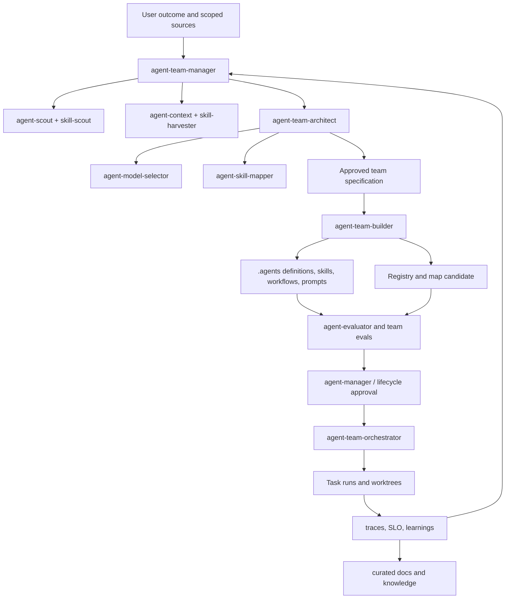

# Unified Plan: Agent Teams, Skills Mapping, and Agent OS

Status: **implemented - phases 0-8 completed**

Date: **2026-07-31**

Scope: agent-oriented skills, project-local `.agents`, registries, team workflows,
model selection, docs/memory, and Agentic OS.

The implementation outcome was released in marketplace `3.2.0`; the stable
individual-agent portfolio and `agentkit@1.0.0` were completed in `3.3.0`. The
historical proposed/approved wording below is preserved as rationale. The
current user workflow and concrete scenarios are documented in
[ONBOARDING.md](ONBOARDING.md) and [use-cases/](use-cases/README.md).

## 1. Decisions Proposed for Review

1. Create `agent-team-manager`, `agent-team-builder`,
   `agent-team-orchestrator`, and `agent-skill-mapper`, but separate their
   decision rights and mutation boundaries.
2. Add `agent-team-architect`: without a separate design owner, the manager or
   builder will inevitably become a mega-skill.
3. Do not create `agent-harvester` in the first stage. Extend `agent-context`
   and use `skill-harvester` for generic source intake.
4. Use JSON as the canonical asset registry/map, use JSON Schema for validation,
   and generate Markdown views for humans, an LLM Wiki, and Obsidian.
5. Store project-local definitions, teams, workflows, prompts, and skills in
   `.agents/`; do not store secrets or durable runtime history there.
6. Treat `docs/` as a curated knowledge/documentation plane, but not as the
   only runtime state or automatically trusted memory.
7. Introduce `agent-model-selector`: model assignment is a reviewable design
   decision, not a free-form author field.
8. Decompose Agent OS into multiple plane-oriented skills and master prompts,
   rather than creating a single all-powerful `agent-os` skill.
9. Create schemas, validators, and read-only inventory first; only then allow
   builders/mappers to mutate agent definitions.
10. Make changes to existing metaskills as separate candidates with SemVer,
    evals, generated rebuilds, and rollback.
11. Use `docs/AGENT-ASSET-REGISTRY.json` as the canonical discriminated
    registry for agents, skills, commands, workflows, and teams. Do not create
    the old name `AGENT-SKILLS-REGISTRY` as a second source of truth.
12. A private command inherits the version of the agent definition and has its
    own revision/content hash; a private/public skill retains its own SemVer.
13. `owner_agent_ref` defines the technical consumer, while
    `accountable_owner` defines the responsible person or team; an agent is not
    a governance owner.

## 2. Current State

- `.agents/` contains the Codex marketplace manifest and local instructions;
  project agent definitions in this repository are not yet activated.
- `skills-lock.json` is currently absent from the repository; any skills-lock
  formats must be discovered/validated, not assumed.
- `docs/AGENT-ASSET-REGISTRY.*` and `docs/AGENT-SKILLS-MAP.*` are implemented
  as canonical JSON plus generated Markdown review views.
- The agent best-practices corpus exists in
  `skills/agent-skills/agent-best-practices/best-practices/`.
- Shared base and master prompts for agent-oriented skills exist in
  `docs/prompts/`.
- Canonical skills live in a single category level under `skills/`; generated
  plugin trees must not be edited directly.

Consequence: the first implementation slice is contracts and read-only
discovery, not automatic team creation.

## 3. Target Model



`agent-team-manager` is the control-plane facade and lifecycle coordinator. It
may carry an end-to-end request through to completion via specialists, but it
does not implement their work internally.

### 3.1 Optimizing Skill Growth: Public and Agent-Private Capabilities

Decision: adopt the idea with clarified semantics. `private` means
**agent-scoped discovery and binding**, not secrecy. A process with filesystem
access can read the file; confidentiality is enforced by repository ACLs,
sandboxing, runtime identity/policy, and separate credentials.

Visibility is a separate profile layered on top of the primary archetype, not a
new skill type. Before creating each capability, apply the placement gate:

| Decision | Criterion |
|---|---|
| `INLINE` | short stable rule without resources, tests, or lifecycle |
| `PRIVATE_COMMAND` | one agent, narrow named action/template |
| `PRIVATE_SKILL` | one agent, reusable multi-step capability with resources/scripts/evals |
| `PUBLIC_SKILL` | two independent consumers or an independent owner/contract/release lifecycle |
| `TOOL_SCRIPT` | deterministic execution is the primary constraint |
| `WORKFLOW` | durable stages/state/coordination is the primary constraint |
| `USE_EXISTING`/`REJECT` | duplication or insufficient value |

This prevents uncontrolled public skill sprawl and the growth of opaque
mega-prompts inside agents. A private skill retains identity, SemVer, evals,
and a registry entry; a private command has a lightweight contract and is
registered as an owned agent asset.

Promotion `private -> public` occurs when a second independent consumer or an
independent lifecycle appears. Demotion `public -> private` is allowed only
after consumer inventory proves a single remaining owner. Both operations are
topology migrations through `skill-refactor`, not folder moves.

## 4. Boundaries of the New Skills

### 4.1 `agent-team-architect` - add

Primary archetype: orchestration/design workflow.

Responsibilities:

- analyze the goal, codebase, documents, data, constraints, and risk;
- build the capability/task graph;
- decide where code/workflow, an agent, a subagent, an orchestrator, or a
  human is needed;
- define roles, mission, non-goals, tools, permissions, context, and state;
- choose topology, communication, handoff, and independent verification;
- choose a sequential/parallel/DAG/dynamic workflow;
- define the worktree/write-set strategy;
- request a model recommendation from `agent-model-selector`;
- request skill bindings from `agent-skill-mapper`;
- create an immutable `AGENT-TEAM-SPEC.json` and a human-readable plan.

It does not create `.agents` and does not launch the team. A design change
after approval creates a new spec revision.

### 4.2 `agent-team-manager`

Primary archetype: meta/router + lifecycle orchestration.

Modes:

- `assess` - worth, inventory, and readiness;
- `design` - dispatch `agent-team-architect`;
- `build` - dispatch `agent-team-builder` after approval;
- `map-skills` - dispatch `agent-skill-mapper`;
- `evaluate` - dispatch evaluator;
- `activate/suspend/retire` - dispatch lifecycle manager;
- `run` - dispatch `agent-team-orchestrator`;
- `audit/reconcile` - registry, definitions, mappings, and observed state;
- `resume` - restore the phase ledger and run a drift check.

Overall flow:

1. Resolve the outcome, exact sources, authority, and destination.
2. Inventory existing agents, skills, locks, workflows, and docs.
3. `agent-scout` checks whether agents/roles are necessary.
4. `skill-scout` checks whether new skills are necessary.
5. `agent-context`/`skill-harvester` fill evidence gaps.
6. The architect creates the team spec and alternative workflows.
7. The manager presents options, models, worktrees, mutations, and risks.
8. After selection, the builder creates staged project-local artifacts.
9. The evaluator verifies definitions, routing, delegation, safety, and E2E.
10. The manager updates lifecycle state only after approval/evidence.

The manager does not mutate active definitions at the same time as evaluation
and does not launch the team merely because files were created.

### 4.3 `agent-team-builder`

Primary archetype: artifact/template + script-backed workflow.

Input: approved, versioned `AGENT-TEAM-SPEC.json`.

Responsibilities:

- create a staged `.agents` tree;
- call `agent-architect` for role/agent master prompts and definitions;
- call `skill-architect` for missing project-local skills;
- create orchestrator/team/workflow prompts;
- create an Agent OS prompt only if the spec requires a platform layer;
- materialize model policies and skill bindings;
- create/update canonical registry/map candidates atomically;
- run schemas, official validators, and package evals;
- return the diff, artifacts, evidence, and rollback.

The builder does not decide whether a team is needed, does not reselect the
topology, and does not activate built agents.

### 4.4 `agent-team-orchestrator`

Primary archetype: runtime orchestration.

Input: approved team/version, task envelope, authority, and budgets.

Responsibilities:

- classify the task against team capabilities;
- propose 2-4 viable workflows when there is a significant design choice;
- build the task DAG, dependencies, owners, and exit gates;
- choose sequential/parallel/fork-join/worktree execution;
- dispatch agents/subagents with minimal context capsules;
- manage leases, budgets, checkpoints, retries, and cancellation;
- integrate outcomes through an independent verifier;
- maintain run state and evidence;
- complete, escalate, or safely stop the run.

It does not mutate static team/agent/skill definitions during a run.
Improvement signals go to manager/doctor/optimizer as a new candidate change.

### 4.5 `agent-skill-mapper`

Primary archetype: evaluation/tool integration.

Modes:

- `inventory` - read-only agents/skills/locks/registry;
- `recommend` - candidate mappings with evidence;
- `apply` - staged agent/map updates after approval;
- `verify` - host discovery and functional binding;
- `reconcile` - drift, missing/unknown/incompatible bindings;
- `unmap/migrate` - consumer-safe removal/replacement.

Sources:

- registered project agents;
- `.agents` definitions;
- canonical skill registry;
- `skills-lock.json`, if it exists and its schema is known;
- project-created skills;
- installed/discoverable target-host skills;
- marketplace/lock/provenance metadata;
- behavior/routing/security eval evidence.

Matching considers capability, positive/negative triggers, input/output schemas,
host compatibility, versions, tools, permissions, data policy, risk, context
cost, owner, and eval status. Semantic similarity or a skill name alone is not
sufficient.

Mutation rules:

1. Show the candidate mapping and exact agent diff.
2. Verify skill provenance, version, availability, and trust state.
3. Obtain mutation authority.
4. Update the canonical map and generated agent bindings in one staged
   candidate.
5. Bump the affected agent version.
6. Run routing, coexistence, authority, and E2E evals.
7. Update the registry version/hash after pass.
8. Never install a missing skill by implication; hand off to `skill-manager`.

### 4.6 `agent-model-selector` - add as a required dependency

Primary archetype: evaluation/router.

Responsibilities:

- discover the current host/provider model catalog;
- derive capability constraints for each role/task;
- create a representative task set and safety/latency/cost floors;
- evaluate candidate models and reasoning/effort settings;
- recommend a fixed, tiered, or routed model policy;
- record version/snapshot, evidence, fallback, and review date;
- trigger re-evaluation on deprecation, behavior drift, or task change.

The model selector does not change model assignment in place; builder/manager
applies an approved policy and bumps the agent version.

### 4.7 `agent-workspace-manager` - recommended

A separate script-backed skill is required if teams regularly execute parallel
code changes.

Responsibilities:

- worktree inventory and collision check;
- create/assign a worktree to an exact task/write-set;
- verify base revision and branch policy;
- heartbeat/status and orphan detection;
- integration handoff;
- safe cleanup after merge/abandonment.

A worktree is not a security boundary and is unnecessary for read-only
research, non-overlapping artifacts outside Git, or a short single-agent task.

### 4.8 `agent-knowledge-manager` - recommended

Owns the curated docs/memory plane, provenance, freshness, Graphify, and
optional indexes. It is not runtime conversation memory and does not allow all
agents to overwrite the knowledge base.

## 5. Decision on `agent-harvester`

**Do not create it now.**

Reasons:

- `skill-harvester` already supports repository/document/session/trace intake;
- the created master prompt `agent-context` covers agent definitions, policies,
  traces, runbooks, pairwise comparison, and external intake;
- a separate harvester would create overlap in triggers, inbox, and provenance;
- downstream output still must pass through architect/evaluator.

The following routes should be added to `agent-context`:

- `external-agent-intake`;
- `agent-pattern-harvest`;
- `trace-and-failure-harvest`;
- `team-context-build`;
- `agent-pairwise-comparison`.

Revisit this decision only after both conditions are met:

1. At least three recurring workflows need to extract reusable agent
   components from external agent ecosystems.
2. The output differs from `AGENT_CONTEXT.md`: a versioned component manifest,
   license/supply-chain review, and downstream packaging are required.

Then `agent-harvester` may own reusable component intake specifically, while
`agent-context` owns the evidence context of a particular decision.

## 6. Registry and Mapping Format

### 6.1 Format decision

Canonical:

- `docs/AGENT-ASSET-REGISTRY.json`;
- `docs/AGENT-SKILLS-MAP.json`.

Generated human views:

- `docs/AGENT-ASSET-REGISTRY.md`;
- `docs/AGENT-SKILLS-MAP.md`.

Schemas:

- `docs/schemas/agent-asset-registry.schema.json`;
- `docs/schemas/agent-skills-map.schema.json`;
- `docs/schemas/agent-team-spec.schema.json`;
- `docs/schemas/agent-definition.schema.json`.

Why not Markdown-only: tables do not provide strict types, uniqueness,
referential integrity, or atomic validation. Why not YAML as canonical: the
convenience of manual editing does not offset ambiguous scalar types, anchors,
and parser differences. JSON remains portable and validates well; Markdown is
generated for Obsidian/GitHub.

### 6.2 Registry contract

The asset registry stores typed inventory and lifecycle, not runtime state. A
stable ID does not depend on a locator; a file move does not change identity:

```json
{
  "schema_version": 1,
  "revision": 1,
  "updated_at": "2026-07-30T00:00:00Z",
  "assets": [
    {
      "id": "asset://project/agent/code-reviewer",
      "kind": "agent",
      "name": "code-reviewer",
      "version": "1.0.0",
      "content_sha256": "sha256:...",
      "source": ".agents/definitions/code-reviewer/agent.json",
      "accountable_owner": "team-or-person",
      "status": "candidate",
      "risk_tier": "R1",
      "model_policy_ref": "model-policy://code-reviewer-v1",
      "team_refs": [],
      "workflow_refs": [],
      "eval_evidence": [],
      "replacement": null
    },
    {
      "id": "asset://project/skill/code-review",
      "kind": "skill",
      "name": "code-review",
      "version": "1.0.0",
      "source_type": "project|installed|locked|marketplace|external",
      "locator": ".agents/skills/code-review",
      "content_sha256": "sha256:...",
      "visibility": "public|private",
      "scope": "repository|project|agent",
      "discoverability": "global|project|agent_scoped",
      "owner_agent_ref": null,
      "allowed_consumers": [],
      "accountable_owner": "team-or-person",
      "provenance": {},
      "host_compatibility": [],
      "trust_status": "unreviewed|verified|quarantined|revoked",
      "lifecycle_status": "candidate"
    },
    {
      "id": "asset://project/command/code-reviewer/handoff",
      "kind": "command",
      "name": "handoff",
      "version": null,
      "revision": 1,
      "version_strategy": "inherit_agent",
      "parent_version_ref": "asset://project/agent/code-reviewer@1.0.0",
      "content_sha256": "sha256:...",
      "locator": ".agents/definitions/code-reviewer/commands/handoff.md",
      "visibility": "private",
      "scope": "agent",
      "discoverability": "agent_scoped",
      "owner_agent_ref": "asset://project/agent/code-reviewer",
      "allowed_consumers": ["asset://project/agent/code-reviewer"],
      "accountable_owner": "team-or-person",
      "lifecycle_status": "candidate"
    }
  ]
}
```

A discovered unregistered asset is added as candidate/unreviewed only in staged
inventory; discovery does not imply trust, assignment, or activation.

For a private skill/command, `owner_agent_ref` is required,
`allowed_consumers` includes the owner, the locator is inside the canonical
agent-private root, and `discoverability` is `agent_scoped`. The validator
forbids a public entry in a private root and a private binding for an
unauthorized agent.

### 6.3 Mapping contract

The map is the canonical binding source. Host adapters render embedded skill
lists from it; manually maintaining two independent maps is forbidden.

```json
{
  "schema_version": 1,
  "revision": 1,
  "bindings": [
    {
      "id": "binding://code-reviewer/code-review",
      "agent_ref": "asset://project/agent/code-reviewer@1.1.0",
      "capability_ref": "asset://project/skill/code-review@^1.0.0",
      "mode": "required|optional|fallback",
      "capabilities": ["review.code.correctness"],
      "activation": "always|on_intent|by_orchestrator",
      "constraints": [],
      "evidence": [],
      "status": "candidate|verified|deprecated|revoked",
      "owner": "..."
    }
  ]
}
```

The validator checks uniqueness, agent/skill references, compatible versions,
status, cycles, unavailable required skills, permission escalation, and parity
with generated host bindings.

### 6.4 Version policy for skill mapping

- **Patch**: non-functional metadata/description was fixed; the runtime binding
  did not change.
- **Minor**: a backward-compatible optional/required capability was added
  without changing mission/input/output/authority; behavior evals are required.
- **Major**: a required skill was removed/replaced, or mission, contracts,
  permissions, data classes, state ownership, or compatibility changed.
- The mapping revision increments on every map change.
- The registry agent entry updates only together with the definition hash and
  candidate evidence; the version must not increment without a real artifact
  change.

## 7. Target `.agents` Structure

```text
.agents/
├── definitions/                 # canonical project-local agent definitions
│   └── <agent>/
│       ├── agent.json
│       ├── prompt.md
│       ├── skills/              # private, scoped to this agent
│       │   └── <skill>/SKILL.md
│       ├── commands/            # private lightweight named actions
│       │   └── <command>.md
│       └── adapters/            # only required host projections
├── teams/
│   └── <team>/team.json
├── workflows/
│   └── <workflow>/workflow.json
├── skills/                      # public project-local skills
│   └── <skill>/SKILL.md
├── prompts/                     # generated role/team/OS prompts
├── policies/                    # project policy refs, no secrets
├── schemas/                     # runtime-local schemas if not in docs/schemas
├── evals/                       # team/agent integration fixtures
├── plugins/                     # existing Codex marketplace view
└── state/                       # ephemeral; gitignored or external durable store
```

Rules:

- `.agents/definitions`, `teams`, `workflows`, `skills`, `prompts`, `policies`
  are version-controlled procedural assets.
- `.agents/state` contains runs, leases, heartbeats, worktree assignments, and
  checkpoints; secrets are external, and retention is explicit.
- `AGENTS.md` remains the repository instruction surface, not a substitute for
  agent definitions or the registry.
- Platform-specific file names/locations are adapters and MUST be verified
  against current host docs before generation.
- Generated projections contain source/hash headers and are not edited
  manually.
- Global loaders scan only approved public roots. Runtime attaches an agent's
  private root after identity/policy resolution; wildcard scanning of
  `definitions/*/skills` is forbidden.
- Every public/private skill and private command is registered. Path placement
  is evidence, while the registry plus observed loader behavior form the
  enforced contract.

## 8. Model Recommendation Policy

### 8.1 Core principle

Do not assign the "smartest" model; assign the minimal model/configuration that
consistently passes role-specific quality and safety floors. Official guidance
also recommends matching capability, latency, and cost, and using smaller
models for simple high-volume subtasks
([OpenAI models](https://developers.openai.com/api/docs/models),
[Anthropic model choice](https://platform.claude.com/docs/en/about-claude/models/choosing-a-model),
[Google Gemini models](https://ai.google.dev/gemini-api/docs/models),
[Microsoft host guidance](https://learn.microsoft.com/en-us/agents/architecture/host-platform)).

The model names below are current examples, checked on 2026-07-30, not eternal
defaults. `agent-model-selector` must read the current provider/host catalog and
run evals before fixing a production policy.

### 8.2 Recommended tiers for the current Codex/OpenAI portfolio

| Role/task | Starting model policy | Reasoning | Escalation |
|---|---|---|---|
| Router, classifier, formatter | GPT-5.6 Luna where available; otherwise Terra | none/low | Terra medium on low confidence |
| Document extraction/indexing | Luna or Terra | low/medium | Sol only for ambiguous synthesis |
| Routine specialist/subagent | GPT-5.6 Terra | medium | high or Sol on failed gate |
| Coding implementer | Terra medium/high | task-dependent | Sol high for difficult architecture/debugging |
| Architect/team designer | GPT-5.6 Sol | high | xhigh for measured hard cases |
| Orchestrator/merge owner | Sol or Terra after eval | medium/high | Sol high on conflict/high risk |
| Independent evaluator/security | Sol, isolated context | high/xhigh | alternate strong model family if policy allows |
| Long-horizon critical analysis | Sol | xhigh; max/pro only if eval gain | human approval/peer review |

OpenAI currently positions GPT-5.6 Sol for complex reasoning/coding, Terra for
balance, and Luna for high-volume cost-sensitive work. Current guidance says to
test the same reasoning setting and one lower; `max`/pro should be reserved for
measured quality-first workloads
([model guidance](https://developers.openai.com/api/docs/guides/latest-model)).

For Claude/Gemini adapters, use the same tiers: a capability-first model for
architecture/high autonomy, a balanced model for general specialists, and a
fast model for routing/extraction/subagents. Anthropic separately recommends
benchmarking on actual prompts/data and notes that effort tuning may be better
than switching models; Google distinguishes stable models from
preview/latest/experimental and recommends pinned stable IDs for production.

### 8.3 Model policy artifact

```json
{
  "id": "model-policy://code-reviewer-v1",
  "selection": "fixed|tiered|router",
  "host": "codex",
  "primary": {"model": "gpt-5.6-terra", "reasoning": "high"},
  "fallbacks": [],
  "capability_requirements": ["tools", "coding", "structured_output"],
  "quality_floors": {},
  "latency_budget_ms": 0,
  "cost_budget": {},
  "data_policy": {},
  "eval_suite": "eval://model-fit/code-reviewer-v1",
  "last_verified": "2026-07-30",
  "review_trigger": ["model_deprecation", "task_change", "regression"]
}
```

### 8.4 Model-selection evals

- actual role tasks, not generic benchmarks;
- tool calling and structured outputs;
- long-context degradation;
- refusal/authority behavior;
- adversarial and edge cases;
- repeated runs/variance;
- latency, total tokens, cost per successful outcome;
- fallback and provider outage;
- correlated error between producer/evaluator;
- pinned version and deprecation behavior.

Deterministic registry/schema/worktree checks remain scripts, not LLM tasks.

## 9. Docs, LLM Wiki, Obsidian, Graphify, and Memory

### 9.1 Storage separation

| Layer | Source of truth | Contents |
|---|---|---|
| Project knowledge | `docs/` | curated facts, decisions, requirements, runbooks |
| Procedural capability | `.agents/`, skills | definitions, prompts, workflows, policies |
| Inventory/bindings | registry/map JSON | identity, lifecycle, exact relations |
| Runtime state | durable runtime store / `.agents/state` | tasks, leases, checkpoints, runs |
| External skill state | `skills-lock.json` when present | installed/resolved skill versions |
| Search/graph indexes | generated/local services | derived BM25/vector/graph projections |

Docs must not store raw chain-of-thought, secrets, arbitrary production memory,
or rapidly changing scheduler state.

### 9.2 LLM Wiki / Obsidian-compatible structure

```text
docs/
├── INDEX.md
├── AGENT-ASSET-REGISTRY.json
├── AGENT-ASSET-REGISTRY.md
├── AGENT-SKILLS-MAP.json
├── AGENT-SKILLS-MAP.md
├── agents/
├── roles/
├── teams/
├── workflows/
├── skills/
├── models/
├── requirements/
├── decisions/
├── runbooks/
├── incidents/
├── learnings/
├── knowledge/
│   ├── concepts/
│   ├── sources/
│   ├── conflicts/
│   └── maps-of-content/
├── schemas/
└── generated/
```

Markdown pages SHOULD use portable frontmatter:

```yaml
---
id: doc://architecture/agent-team
type: architecture
status: approved
owner: team-or-person
version: "1.0.0"
updated_at: 2026-07-30
sources: []
related: []
tags: [agents, orchestration]
---
```

Use standard Markdown links as canonical; Obsidian wikilinks may be generated
or added as optional aliases, but not as the only machine-readable relation.

LLM Wiki practices:

- atomic pages with stable IDs;
- maps of content instead of one huge wiki page;
- facts separated from interpretation;
- source/provenance and checked date;
- contradiction pages rather than silent overwrite;
- owner/freshness/consumer for each durable document;
- inbox -> review -> publish workflow;
- supersede decisions, preserve history;
- summaries link to raw evidence rather than replace it.

### 9.3 Graphify

Graphify derives nodes and typed edges from docs frontmatter, registries, maps,
Markdown links, and code/requirements/eval references.

Recommended node types:

- Agent, Role, Team, Skill, Workflow, Tool, Model, Policy;
- Document, Requirement, Decision, Source, Eval, Incident, Learning;
- Runtime, Repository, DataClass, Owner.

Recommended edges:

- `HAS_ROLE`, `USES_SKILL`, `USES_MODEL`, `CALLS_TOOL`;
- `PART_OF_TEAM`, `ORCHESTRATES`, `HANDOFF_TO`, `DEPENDS_ON`;
- `IMPLEMENTS`, `VERIFIED_BY`, `DERIVED_FROM`, `SUPERSEDES`;
- `OWNED_BY`, `GOVERNED_BY`, `OBSERVED_BY`, `AFFECTED_BY`.

The generated graph contains a source locator, revision/hash, confidence, and
timestamp. The graph is a projection; canonical docs/registries remain
authoritative.

### 9.4 Vector and graph databases

Progressive adoption:

1. **Level 0:** Markdown + frontmatter + JSON registry/map + exact search.
2. **Level 1:** local full-text/BM25 and generated knowledge graph JSON.
3. **Level 2:** Qdrant vector index for semantic retrieval.
4. **Level 3:** Neo4j knowledge graph + Qdrant hybrid retrieval/GraphRAG.
5. **Level 4:** managed multi-tenant knowledge plane with policy-aware
   retrieval.

Neo4j + Qdrant setup requires separate design:

- Docker/managed deployment and version pins;
- data classification, network, auth, backup, and retention;
- embedding model/version and reindex policy;
- tenant/project isolation;
- deletion propagation and source tombstones;
- ingestion idempotency and reconciliation;
- hybrid ranking and provenance in answers;
- SLO, monitoring, cost, and disaster recovery.

Do not deploy GraphRAG by default. Gate it on corpus scale, multi-hop query
need, measured retrieval failures, and available operator ownership.

### 9.5 Memory write policy

- Working memory belongs to the current run and expires.
- Episodic memory stores sanitized event summaries with provenance/TTL.
- Semantic memory enters docs only after curation/verification.
- Procedural memory is versioned agents/skills/workflows.
- Policy memory comes only from controlled authoritative files.
- Agents write new facts to inbox/candidate state; a knowledge steward approves
  publication.
- Retrieval records source IDs and does not treat vector similarity as truth.

## 10. Agent OS: Skill and Prompt Decomposition

One Agent OS master prompt will be too broad. Create a shared
`docs/prompts/agent-os-base.md` and exactly one plane-specific prompt.

### 10.1 First-wave Agent OS

| Skill | Plane | Master prompt |
|---|---|---|
| `agent-os-architect` | all/control | `agent-os-architect-skill.md` |
| `agent-os-bootstrapper` | platform build | `agent-os-bootstrapper-skill.md` |
| `agent-registry-manager` | control | `agent-registry-manager-skill.md` |
| `agent-runtime-manager` | execution | `agent-runtime-manager-skill.md` |
| `agent-knowledge-manager` | knowledge | `agent-knowledge-manager-skill.md` |
| `agent-policy-manager` | assurance/control | `agent-policy-manager-skill.md` |
| `agent-observer` | operations | `agent-observer-skill.md` |
| `agent-os-evaluator` | assurance | `agent-os-evaluator-skill.md` |

### 10.2 Second-wave Agent OS

| Skill | When to split out |
|---|---|
| `agent-model-router` | Multi-model routing is needed in production, not only in design |
| `agent-protocol-manager` | Real MCP/A2A cross-boundary integrations |
| `agent-scheduler` | Durable multi-tenant queues/leases/backpressure |
| `agent-memory-manager` | Runtime memory has separated from curated knowledge |
| `agent-incident-manager` | There are production SLO/on-call and recurring incidents |
| `agent-cost-manager` | Spend requires a dedicated budget/FinOps control plane |

Do not create a separate skill if it is only a route of an existing manager or
a script. Split only when there are separate permissions, owner, SLO, state,
and release cadence.

### 10.3 `agent-os-base.md` contract

The shared prompt must require:

- experience/control/execution/knowledge/assurance/operations planes;
- desired versus observed state;
- capability/agent/skill/workflow/model registries;
- identity, least privilege, PDP/PEP, and approval;
- durable task state, idempotency, leases, checkpoints, cancellation;
- artifact/provenance graph and memory tiers;
- telemetry, budgets, reconciliation, incident, and recovery;
- model selection/router policy;
- MCP/A2A adapters through ports-and-adapters;
- eval, shadow, canary, rollback, deprecation, and retirement;
- operator ownership and SLO.

### 10.4 Agent OS master prompts to create

1. `agent-os-base.md` - shared platform contract.
2. `agent-os-architect-skill.md` - planes, boundaries, ADRs, threat/failure
   model.
3. `agent-os-bootstrapper-skill.md` - minimal walking skeleton and staged
   setup.
4. `agent-registry-manager-skill.md` - identities, manifests, versions,
   desired state.
5. `agent-runtime-manager-skill.md` - execution leases, queues, checkpoints,
   saga.
6. `agent-knowledge-manager-skill.md` - docs/wiki/graph/vector ingestion and
   curation.
7. `agent-policy-manager-skill.md` - policies, approvals, credentials, and
   audit.
8. `agent-observer-skill.md` - traces, SLO, MAPE-K, budgets, and incidents.
9. `agent-model-router-skill.md` - fixed/tiered/dynamic model routing with
   evals.
10. `agent-protocol-manager-skill.md` - MCP/A2A and host adapters.
11. `agent-os-evaluator-skill.md` - distributed, safety, resilience, and
    lifecycle evals.

## 11. Master Prompts for Team Skills

Add to `docs/prompts/`:

1. `agent-team-architect-skill.md`;
2. `agent-team-manager-skill.md`;
3. `agent-team-builder-skill.md`;
4. `agent-team-orchestrator-skill.md`;
5. `agent-skill-mapper-skill.md`;
6. `agent-model-selector-skill.md`;
7. `agent-workspace-manager-skill.md`;
8. `agent-knowledge-manager-skill.md`;
9. `agent-capability-placement.md`;
10. `agent-private-skill.md`;
11. `agent-private-command.md`;
12. `agent-skill-visibility-migration.md`.

Each is applied after the existing `agent-skill-base.md`. Team prompts must not
duplicate plane-specific Agent OS prompts; a team operates in project scope,
Agent OS in platform/multi-run/multi-team scope.

The builder additionally creates role prompts for:

- lead/orchestrator;
- bounded specialist/subagent;
- planner;
- implementer;
- integration owner;
- independent verifier/evaluator;
- security/reliability reviewer;
- context/knowledge curator;
- operator/incident role.

Create only roles proven by the task/capability graph. One role may remain a
human responsibility or a mode of an existing agent.

## 12. Changes to Existing Skills

### 12.1 `skill-architect`

Add:

- optional `agent-system-profile.md`;
- registry write contract;
- atomic update of the staged bundle + registry candidate;
- creation record with version/hash/owner/status/provenance;
- generated Markdown projection update;
- rollback, conflict, and missing-registry behavior;
- routing exclusions between skill changes and runtime agent changes;
- placement gate and visibility profile;
- public/private canonical roots, owner/consumer validation, and access evals.

The created skill is registered in `docs/AGENT-ASSET-REGISTRY.json`; the
Markdown view is generated. If the registry does not exist, the initializer
creates a schema-valid candidate only after destination and authority are
resolved.

Baseline is implemented in `skill-architect@1.1.0`: visibility remains an
overlay rather than a ninth archetype; Phase 1 adds the shared schema and
atomic registry tooling.

### 12.2 `agent-architect` master prompt

Add:

- required registry candidate update for the created agent definition;
- exact version/hash/model-policy/owner/risk/lifecycle fields;
- no direct active registration;
- generated Markdown view;
- failure atomics: agent files and registry must not diverge;
- evaluator handoff before verified/approved status.

### 12.3 `skill-scout`

Add decisions for `CREATE_AGENT_SKILL`, `USE_EXISTING_AGENT`,
`USE_CODE_OR_WORKFLOW`; never create an agent from a repeated keyword alone.

### 12.4 `skill-harvester`

Add agent-related harvest units, but keep the generic source-inbox boundary. Do
not output a harvested agent definition as trusted/active.

### 12.5 `skill-evaluator`

Add an agent-oriented skills profile: registry/map parity, definition
versioning, model-selection evidence, delegation/worktree/runtime side effects.

### 12.6 `skill-builder`

Add scenario `create-agent-lifecycle-skill` and prompt routing into the new
team/OS master prompts. It creates skills, not activated agents.

### 12.7 `skill-manager`

Manages installed skills and `skills-lock.json`, but not runtime agents. It
hands verified installed inventory to the mapper; it does not mutate agent
bindings.

Add separate inventory of public/private roots, registry parity, and owner and
allowed-consumer enforcement. Private activation means scoped attachment, not a
copy into a public root. Baseline is implemented in `skill-manager@1.1.0`.

### 12.8 `agent-best-practices`

When created, it owns refreshing current provider/model/host guidance and
produces modification prompts. The current static corpus remains a source, but
does not automatically rewrite active agents.

### 12.9 `skill-refactor`

Add decisions `PROMOTE_PUBLIC` and `DEMOTE_PRIVATE`, a consumer gate,
registry/map/adapter migration, owner-agent SemVer impact, coexistence, and
access evals. Baseline is implemented in `skill-refactor@1.1.0`.

## 13. Core Workflows

### 13.1 Creating a team from project context

```text
scope and authority
→ inventory code/docs/data/agents/skills/locks
→ agent/skill worth gates
→ context research if gaps
→ task/capability graph
→ capability placement: inline/private command/private skill/public/tool/workflow
→ roles/topology/workflow/worktree alternatives
→ model selection + skill mapping
→ approved team spec
→ staged .agents build + registry/map candidate
→ independent eval
→ approve/register
→ optional activation and run
→ observation and learning
```

### 13.2 Mapping new or unregistered skills

```text
discover local/installed/locked skills
→ provenance/trust/compatibility inventory
→ registry candidate entries
→ agent capability matching
→ mapping recommendation
→ user/owner approval
→ staged map + agent version change
→ coexistence/E2E eval
→ register verified mapping
```

### 13.3 Task execution and worktrees

```text
task envelope
→ select approved team/version
→ task DAG and write-set analysis
→ no-worktree / single / per-worker worktree decision
→ dispatch with leases/context capsules
→ verify branch artifacts
→ integration owner
→ independent outcome verifier
→ close or recover worktrees
→ run evidence and learnings
```

### 13.4 Agent OS bootstrap

```text
one bounded production use case
→ planes and contracts
→ registry + policy + durable run state
→ one agent + one workflow walking skeleton
→ telemetry/eval/recovery
→ shadow/canary
→ operations readiness
→ extract reusable platform capabilities
```

Do not start with a universal multi-tenant platform before the walking
skeleton.

### 13.5 Creating a private capability

```text
capability contract + consumers
→ agent-capability-placement
→ private command OR base + archetype + agent-private-skill
→ staged owner-agent definition + registry/map candidate
→ structural/routing/behavior/access evals
→ independent evaluator
→ manager register/attach
→ verify owner use + global non-discovery + unauthorized denial
```

### 13.6 Promotion or demotion

```text
consumer inventory
→ skill-refactor visibility decision
→ stage destination candidate
→ registry/map/agent/adapters migration plan
→ coexistence + access + rollback evals
→ manager rollout
→ observed host/consumer verification
→ retire source
```

## 14. Final Phased Implementation Plan

### Phase 0 - Decision lock - approved

Deliverables:

- approve skill boundaries and names;
- approve JSON canonical + Markdown projections;
- approve `.agents` layout;
- approve public/private semantics, canonical roots, and promotion threshold;
- choose the first target hosts/runtimes;
- choose whether external provider models are allowed;
- designate owners/approvers/operators.

Exit: ADR records decisions; no active mutation.

### Phase 0.5 - Host conformance and walking-skeleton contract - completed

Create:

- ADRs for asset registry, visibility, version inheritance, and ownership;
- the current host capability matrix for Codex, Claude Code, and Cursor;
- the canonical-to-host adapter contract with `native`, `generated`, and
  `unsupported` outcomes;
- one fixture containing a public skill, a private skill, a private command,
  and one owning agent;
- deny-by-default tests proving private roots are not global discovery roots.

Codex adapter: project agents live in `.codex/agents/*.toml`; the exact private
skill path is enabled through agent-local `skills.config`. Claude adapter:
preload does not restrict later Skill access, so strict private mode removes
the Skill tool and embeds a hash-labeled projection. Cursor adapter uses the
same conservative generated projection until native per-agent isolation is
verified by a fixture on the target version.

Exit: host assumptions are explicit and every unsupported native feature has a
safe generated fallback or a blocking status.

### Phase 1 - Schemas, registries, and deterministic tooling - completed

Create:

- five JSON schemas, including revision-checked asset transactions;
- empty schema-valid registry/map;
- Markdown view generator;
- inventory/reconciliation scripts;
- definition/map/version parity validator;
- source/hash/provenance conventions;
- visibility/scope/owner/allowed-consumer fields and private path containment;
- `.agents/state` retention/gitignore policy.

Tests: malformed refs, duplicates, missing asset, version mismatch, untrusted
skill, mapping cycle, generated-view drift, private asset without owner,
unauthorized private binding, public asset in a private root, global private
discovery, and partial atomic update.

Exit: canonical inventory, fixture adapters, access-denial checks, transaction
rollback, generated-view checks, and repository validation pass.
Installed-skill reconciliation with `skills-lock.json` remains a Phase 3
`skill-manager` route, not a blocker for the registry foundation.

### Phase 2 - Master prompts - completed

Team prompts from section 11 and Agent OS prompts from section 10 are stored in
`docs/prompts/` and routed by `docs/prompts/README.md`. Positive, negative, and
collision cases are required inputs before authoring each skill in Phase 4-7.

Exit: prompts pass lint, authority, boundary, and forward review.

Placement/private/migration prompts from section 11 are already drafted and
must be used as executable inputs for Phase 3-4 rather than copied into skills.

### Phase 3 - Modify foundational metaskills - completed

Candidate changes:

- `skill-architect` registry integration + agent profile;
- `skill-scout` decision taxonomy;
- `skill-harvester` agent source units;
- `skill-evaluator` agent-control profile;
- `skill-builder` agent-skill scenario;
- `agent-architect` prompt registry integration;
- `skill-manager` visibility-aware inventory and lifecycle;
- `skill-refactor` promotion/demotion topology routes.

Each skill gets a SemVer bump, routing/behavior/script evals, a generated
plugin rebuild, and independent release evidence.

Implemented in the `1.4.0` marketplace candidate: `skill-architect`,
`skill-manager`, `skill-refactor`, `skill-scout`, `skill-harvester`,
`skill-evaluator`, and `skill-builder` now share the asset registry,
owner-private placement, and agent-system evaluation/orchestration contracts.
`metaskillpack` was rebuilt from the updated read-only donor snapshots.

Exit: created skill and agent candidates register atomically; active registries
remain unchanged on failed validation.

### Phase 4 - Core team design skills - completed

Build in order:

1. `agent-model-selector`;
2. `agent-team-architect`;
3. `agent-skill-mapper` read-only/recommend mode;
4. `agent-team-builder` staged mode;
5. `agent-team-manager` facade.

Exit: the sample project produces an approved spec and a staged `.agents`
candidate with no runtime activation; unnecessary single-agent capabilities
remain inline or private instead of becoming public skills.

Implemented in the `1.5.0` marketplace candidate: all five skills have
distinct decision and mutation boundaries, machine-readable contracts,
deterministic validators, routing/behavior evals, and forward/adversarial
tests. The team builder requires an approved spec and always stages with
`activation: false`; the mapper rejects cross-owner private bindings; the
manager preserves durable checkpoints and delegates specialist work instead of
becoming a mega-skill.

### Phase 5 - Evaluation and runtime orchestration - completed

Build:

- `agent-team-orchestrator`;
- `agent-workspace-manager` if the code-parallel scenario is selected;
- team-level eval suite;
- durable run/checkpoint contract;
- cancellation, partial failure, and recovery.

Exit: forward tests cover sequential, parallel, one-worker failure, conflict,
budget exhaustion, interruption/resume, and worktree cleanup.

Implemented in the `1.6.0` marketplace candidate: the runtime orchestrator
owns only execution of approved active teams, while the workspace manager owns
the separate worktree ledger and its mutation/cleanup boundary. Typed plan and
ledger validators plus routing/behavior and forward/adversarial tests cover all
exit scenarios without creating real worktrees or inferring runtime authority.

### Phase 6 - Knowledge and memory plane - completed

Build:

- docs structure/frontmatter conventions;
- `agent-knowledge-manager`;
- inbox/curation/freshness workflows;
- Graphify JSON projection;
- retrieval provenance tests.

Decision gate for Qdrant; separate later gate for Neo4j + GraphRAG.

Exit: agents can retrieve authoritative docs and propose memory updates without
silently publishing unverified facts.

Implemented in the `1.7.0` marketplace candidate: `agent-knowledge-manager`, a
portable docs/frontmatter lifecycle, an inbox-to-curator publication gate, and
a deterministic source-hashed Graphify JSON projection. Forward and adversarial
tests cover provenance, duplicate IDs, broken relations, and candidate status;
behavior evals cover poisoning, stale sources, deletion, access denial, drift,
and contradictions. External vector/graph infrastructure remains gated.

### Phase 7 - Minimal Agent OS - completed

Build only the first-order skills needed by one bounded use case:

- `agent-os-architect` and bootstrapper;
- registry/runtime/policy/observer/evaluator;
- reuse model selector and knowledge manager;
- one MCP/A2A adapter only if required.

Exit: the walking skeleton supports a versioned agent, policy-gated task,
durable state, trace, evaluation, recovery, and retirement.

Implemented in the `1.8.0` marketplace candidate for the bounded private
marketplace release use case. Seven public plane-specific skills reuse the
existing team, knowledge, and marketplace layers. A synthetic no-production
fixture links architecture, bootstrap, desired-state reconciliation, policy,
durable execution, telemetry, and independent release evidence; combined
adversarial failures are validated without deploying infrastructure.

### Phase 8 - Marketplace and portfolio release - completed

- package each skill independently;
- category `skills/agents` or the current marketplace equivalent;
- version and provenance entries;
- collision tests with all `skill-*` skills;
- individual install tests for Codex/Claude Code/Cursor as supported;
- aggregate toolkit only after donor stability;
- private canary before public release.

Exit: validators and target-host E2E tests pass; rollback and ownership are
proven.

Completed for private marketplace release `1.8.0`. The portfolio suite proves
collision-free coexistence and one-skill package isolation across all 28
entries. All packages pass repository and Claude Code validation; the seven new
Agentic OS plugins were selectively installed and enabled from the private
GitHub-backed marketplace in Codex, then compared with their canonical package
trees. Cursor passed the supported structural contract. Evidence, rollback, and
ownership are recorded in
[`docs/agent-os/PRIVATE-CANARY-REPORT.md`](agent-os/PRIVATE-CANARY-REPORT.md).

## 15. Evaluation Matrix

| Surface | Required cases |
|---|---|
| Team need | code/workflow sufficient, existing team, new team, keep human |
| Role design | duplicate roles, incompatible permissions, missing owner |
| Workflow | sequential, parallel, dynamic, partial failure, cancellation |
| Worktree | overlap, stale base, orphan, merge conflict, safe cleanup |
| Skill mapping | positive, negative, collision, missing, incompatible, revoked |
| Registry | atomic update, drift, duplicate ID, hash/version mismatch |
| Visibility | owner use, global non-discovery, unauthorized denial, path/registry mismatch |
| Placement | inline, private command, private skill, public, tool/workflow, duplication |
| Migration | private->public, public->private, coexistence, consumers, rollback |
| Model choice | quality, safety, variance, latency, cost, deprecation, fallback |
| Memory/docs | provenance, stale fact, poisoning, deletion, conflict, no source |
| Agent OS | duplicate event, expired lease, partition, backpressure, recovery |
| Authority | denied tool, revoked approval, scope escalation, secret exposure |
| Lifecycle | shadow, canary, rollback, deprecation, drain, and retirement |

## 16. Stop Conditions and Anti-Patterns

Stop implementation when:

- the target host/definition format is unresolved;
- no owner/approver/operator exists for a high-impact team;
- the registry schema or atomicity is not ready;
- model choice has no representative eval set;
- required data/tools cannot be accessed safely;
- the builder would need to edit active definitions without staged rollback;
- GraphRAG has no measured need or operator;
- the new skill duplicates an existing coherent capability;
- the private capability has no stable owner or enforceable scoped loader.

Avoid:

- one team-manager that designs, builds, evaluates, activates, and operates;
- a Markdown registry as the sole source of truth;
- independently maintained registries and agent definitions;
- assigning skills by name similarity;
- auto-install of discovered skills;
- describing a private folder as a confidentiality boundary;
- wildcard discovery of `.agents/definitions/*/skills`;
- creating a public skill for every single-agent helper;
- implementing private/public migration as a folder move only;
- assigning a model by prestige or context-window size alone;
- a frontier model for every subtask;
- a worktree as a sandbox;
- docs as an uncurated conversation dump;
- treating a vector-search result as fact;
- GraphRAG before source/provenance discipline;
- building Agent OS before one production walking skeleton;
- auto-evolution of prompts, policy, or memory without a new version and eval.

## 17. Review Decisions and Outcomes

1. `agent-team-architect` was implemented as a separate skill.
2. JSON was accepted as the canonical registry/map; Markdown is the generated
   review view.
3. `.agents` was accepted for project assets; Claude Code, Codex, and Cursor
   have separate generated adapters/manifests.
4. `agent-model-selector` was implemented as a separate evidence-backed gate.
5. `agent-harvester` was not created; generic intake remains with the existing
   context/harvester capabilities.
6. The public/private walking skeleton and the Agentic OS slice were
   implemented in fixtures and release evidence.
7. Cross-provider independence remains a policy option, not a mandatory
   requirement; evaluator correlation is disclosed.
8. Ownership and review responsibilities are fixed in governance/catalog.
9. Qdrant, Neo4j, and GraphRAG remain demand-driven setup decisions with
   provenance/access/deletion/freshness gates.
10. Phases 0-8 were completed sequentially and verified by tests.
11. The placement gate and controlled private/public migration were implemented
    in architecture, prompts, schemas, registries, and skills.

## 18. Implemented Outcome

The schema-valid registry/map, team architecture/model/build layers,
independent evaluation, manager/orchestrator, knowledge plane, and minimal
Agentic OS capabilities are implemented and available as separate selectively
installable skills. Composite `agentkit` was released only after two stable
donor cycles and three artifact-bound workflows. The next step for any project
deployment is not a new portfolio build, but scoped onboarding: select one
agent, team, or Agentic OS vertical slice, create the required private/public
skills, and pass separate build, evaluation, activation, and rollout gates.
